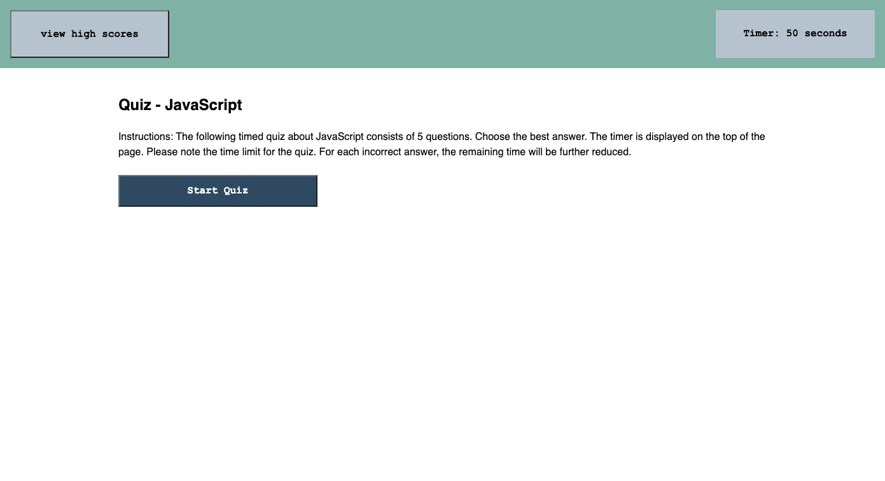

# Timed Quiz (Web APIs)

## Description

Users can access this web application to complete a timed practice quiz consisting of five questions about JavaScript. A timer is displayed on the top of the page, and for each question that is answered incorrectly, the remaining time is further reduced. Users can save their scores along with their initials after completing the practice quiz. Quiz scores are sorted, stored, and displayed. 

The JavaScript code as well as the HTML and CSS files for this timed practice quiz can be accessed via the links below. The use of various Web APIs can be observed from there. Also, in an effort to provide a more responsive layout, flexbox and media queries were used.

## Links and Usage 

To access the deployed application, please visit: https://jamscc.github.io/web-app-timed-quiz/

Users can access the codebase in Chrome by navigating to Chrome DevTools. The codebase can also be accessed via the following link:

https://github.com/jamscc/web-app-timed-quiz

## Screenshot

The following is the screenshot for the web application:

